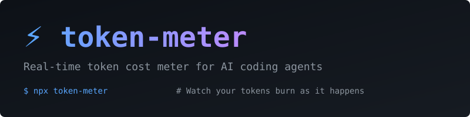

<div align="center">



</div>

# ⚡ Token Meter

<div align="center">

**Real-time token cost meter for AI coding agents. Watch your tokens burn as it happens.**

[](https://www.npmjs.com/package/token-meter)
[](LICENSE)

</div>

---

## What It Does

Your AI agent is running. You want to know **right now** how many tokens each command costs, not after the session ends.

```bash
npx token-meter
```

A live dashboard that shows:

- **Real-time token consumption** per conversation turn
- **Timestamps** next to every message — when it happened, how long it took
- **Cost accumulation** as it happens
- **Tool call tracking** — which tools are being called and when

---

## Quick Start

```bash
# Install globally
npm install -g token-meter

# Auto-detect and watch all agents
token-meter

# Watch specific agent
token-meter -a kimi-code
token-meter -a claude-code
token-meter -a codex

# Refresh every 500ms
token-meter -i 500
```

## What It Looks Like

```
  ⚡ token-meter — Real-time Token Cost Monitor
  ─────────────────────────────────────────────────
  Watching for AI agent activity... (Ctrl+C to exit)

  ────────────────────────────────────────────────────────────────────
  Sessions: 64 │ Tokens: 2.3B │ Cost: $4681.95 │ Msgs: 3256 │ Tools: 11570 │ 14:23:45
  ────────────────────────────────────────────────────────────────────
  YOU 请帮我检查一下项目结构                               [14:23:42]
  AI  我来检查一下你的项目...                              [14:23:43]
  TL  Bash ls -la                                         [14:23:44]
  📊  +1.2Kin / +89out                                    [14:23:44]
  AI  项目结构如下...                                      [14:23:46]
  YOU 看看有没有安全问题                                   [14:23:50]
  TL  Grep pattern: eval|exec|child_process               [14:23:51]
  📊  +3.4Kin / +234out                                   [14:23:51]
```

Every line has a timestamp on the right. You can see exactly when each message happened and how long the AI took to respond.

---

## Options

```
token-meter [options]

Options:
  -a, --agent <type>    Agent type (kimi-code, claude-code, codex, opencode)
  -i, --interval <ms>   Refresh interval in milliseconds (default: 1000)
  -s, --session <id>    Watch specific session ID
  --no-banner           Hide the banner
  -h, --help            Display help
  -V, --version         Display version
```

## Supported Agents

| Agent | Status |
|-------|--------|
| **Kimi Code** | ✅ Supported |
| **Claude Code** | ✅ Supported |
| **Codex** | ✅ Supported |
| **OpenCode** | ✅ Supported |

---

## How It Works

1. **Watches local session files** in real-time (no network requests)
2. **Parses new content** as it's written to disk
3. **Extracts tokens, messages, tool calls** from each line
4. **Displays live** in your terminal with timestamps

## Privacy

- ✅ 100% local — no data leaves your machine
- ✅ Read-only — never modifies session files
- ✅ No API keys — no external services

---

## Related

- [agent-trace](https://github.com/liangzhengtao/agent-trace) — Post-session analysis tool (cost breakdown, tool health, anomaly detection)

## License

[MIT](LICENSE)

---

## 中文版本

[README.zh.md](README.zh.md)
